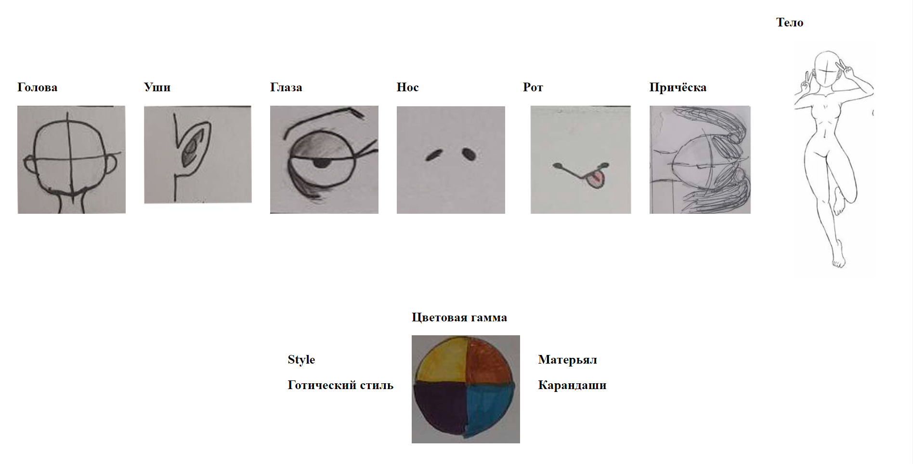

# Создание рандомных персонажей (Create_random_pers): Руководство по использованию и документация

## Оглавление

* [Описание проекта](#описание-проекта)
    * [Основные возможности](#основные-возможности)
    * [Как это работает?](#как-это-работает)
    * [Предварительные требования](#предварительные-требования)
    * [Установите зависимости](#установите-зависимости)
* [Скрипты проекта](#cкрипты-проекта)
* [Основные скрипты](#основные-скрипты)
    * [main.py](#mainpy)
* [Вспомогательные скрипты](#вспомогательные-скрипты)
    * [general_function.py](#general_functionpy)
* [Создание дополнительноо раздела в базе данных?](#создание-дополнительноо-раздела-в-базе-данных) 
* [Как убирать разделы?](#как-убирать-разделы)
* [Как легко перезагрузить сайт?](#как-легко-перезагрузить-сайт)
* [Cоздатели](#cоздатели)    
* [Цель проекта](#цель-проекта)

## Описание проекта

Create_random_pers - готовый челендж для создания перса. Он будет полезен для людей хотевших его провести, но готовится к нему хотят используя минимально количество усилий. И это также подойдёт для людей, который хотят нарисовать большое количество персов, но не хватает придумать какой он должен быть. А мой проект обликчает вам работу он даёт вам уже небольшое количество выбора форм газ, носов, ртов, голов, ушей, причёсок, поз, стилей, цветовых гам и матерьялов. Если вы не нуждаетесь в некоторых функциях, то их  можно убрать из кода они не будут отображать, а можно добавлять. Как это сделат будет описано в следующих разделах.

### Основные возможности

1. Позволяет облекцить вам работу и даёт основные показатели перса
2. Код настраиваимый мы можете убирать и добавлять разделы перса.
3. Мой код имеет начальную информацию.

### Как это работает?

Проект основан на использовании библиотеки Jinja2. Перед работай потребуется сделать небольшое количество работ, чтобы его запустить, но что у вас получится обрадует вас.

Основной акцент делается на создание пользовательской базы данных с вашими основными значениями и дальнейшее взаимодействие с ней, что позволяет работать с данными быстро для создания перса.

### Предварительные требования:

1. Установленный Python версии 3.11 и выше.
2. pip - установщик пакетов Python.
3. Подключение к Интернету (для захода на сайт).

### Установите зависимости

С активированным виртуальным окружением установите зависимости проекта:

```bash
pip install -r requirements.txt
```

## Скрипты проекта:

* [main.py](#mainpy)
* [general_function.py](#generalfunctionpy)

## Основные скрипты

### main.py

#### Что делает скрипт?

С помощью этого инструмента мы создаем документ index.html

Для проверки его работы мы получаем документ при открытие его открывается готовый сайт.

#### Как запустить скрипт?

```bash
python main.py
```

#### Что выведет скрипт?

Если все настроено верно, то мы получим сайт схожий с картинки.

Пример запуска и вывода :

```
C:\Users\User> cd \Desktop\Create_random_pers
C:\Users\User\Desktop\Create_random_pers> pip install -r requirements.txt
C:\Users\User\Desktop\Create_random_pers> python main.py
```

В этом примере мы запускаем файл `main.py`.



В ответ на наш запрос получаем документ `index.html`. Это и есть наш сайт.

Чтобы код не может закончить свою работу показанную тут:

```
C:\Users\User\Desktop\Create_random_pers> python main.py

```

Чтобы код закончил свою работу зажмите эту комбинацию клавишь `Ctrl+C`.

## Вспомогательные скрипты

Следующие скрипты являются вспомогательными и не запускаются отдельно:

### general_function.py

Этот скрипт содержит вспомогательные функции для полученния баззы данных, который создается скриптом **get_info**.

Этот скрипт содержит вспомогательные функции для создания и передачи его в основной в скрипт из файла **main**, который передаётся скриптом **fetch_cards**.

## Создание дополнительноо раздела в базе данных?

Пример одного из раздела базы данных:

```python
images_headers = [
    "1_header.jpg",
    "2_header.jpg",
    "3_header.jpg",
    "4_header.jpg",
    "5_header.jpg",
    "6_header.jpg",
]
```

Если у вас появились новые разделы и новые рисунки. Вы их добавляете в файл `images`. В файле `general_function` вы добавляете раздел в стиле `название_раздела = []` и новые рисунки в стиле, как в примере. И в разделе данные передаются в стиле `'номер_раздел.jpg'` размер картинки должен не привышать 200 на 200 или 1000 на 200/250.

А также чтобы это отображалось на сайте нужно добавить в этот кусок кода:

```python
variables = {
    "Голова": images_headers,
    "Уши": images_ears,
    "Глаза": images_eyes,
    "Нос": images_nose,
    "Рот": images_mouse,
    "Причёска": images_hairstyle,
    "Тело": images_body,
    "Style": styles,
    "Цветовая гамма": images_color_scheme,
    "Матерьял": material,
}
```

А добавить надо в стиле `название_раздела_на_русском`: `название_переменной`

### Например:

Я хочу добавить раздел `Обувь`:

1. Я в папку `images` добавлю картинки:

    1. 1_shoes.jpg
    2. 2_shoes.jpg
    3. 3_shoes.jpg
    4. 4_shoes.jpg
    5. 5_shoes.jpg
    6. 6_shoes.jpg

2. В файл `general_function` добавлю свой раздел:

```python
def get_info():

    # Сюда добавлю

    images_headers = [
        "1_header.jpg",
        "2_header.jpg",
        "3_header.jpg",
        "4_header.jpg",
        "5_header.jpg",
        "6_header.jpg",
    ]
```

Я добавлю вот такую схему:

```python
images_shoes = [
    "1_shoes.jpg",
    "2_shoes.jpg",
    "3_shoes.jpg",
    "4_shoes.jpg",
    "5_shoes.jpg",
    "6_shoes.jpg",
]
```

И у меня получится вот такой кусок кода:

```python
def get_info():

    # Сюда добавила

    images_shoes = [
        "1_shoes.jpg",
        "2_shoes.jpg",
        "3_shoes.jpg",
        "4_shoes.jpg",
        "5_shoes.jpg",
        "6_shoes.jpg",
    ]

    images_headers = [
        "1_header.jpg",
        "2_header.jpg",
        "3_header.jpg",
        "4_header.jpg",
        "5_header.jpg",
        "6_header.jpg",
    ]
```
3. А чтобы это отбражалось надо вот сюда:

```python
variables = {
    "Голова": images_headers,
    "Уши": images_ears,
    "Глаза": images_eyes,
    "Нос": images_nose,
    "Рот": images_mouse,
    "Причёска": images_hairstyle,
    "Тело": images_body,
    "Style": styles,
    "Цветовая гамма": images_color_scheme,
    "Матерьял": material,
    # Сюда добавить мой код
}
```

Мой код:

```python
"Обувь": images_shoes,
```

И у нас получится вот такой кусок кода:

```python
variables = {
    "Голова": images_headers,
    "Уши": images_ears,
    "Глаза": images_eyes,
    "Нос": images_nose,
    "Рот": images_mouse,
    "Причёска": images_hairstyle,
    "Тело": images_body,
    "Style": styles,
    "Цветовая гамма": images_color_scheme,
    "Матерьял": material,
    "Обувь": images_shoes, # Я тут
}
```

4. Мы увидиим, что на сайте добавился новый раздел.

## Как убирать разделы?

Вам потребуется найти в файле `general_function` такой кусок кода:

```python
variables = {
    "Голова": images_headers,
    "Уши": images_ears,
    "Глаза": images_eyes,
    "Нос": images_nose,
    "Рот": images_mouse,
    "Причёска": images_hairstyle,
    "Тело": images_body,
    "Style": styles,
    "Цветовая гамма": images_color_scheme,
    "Матерьял": material,
}
```

И  удалить оттуда любой раздел, что вам не нравится.

### Например:

Я хочу убрать раздел Style и я уберу вот этот кусок кода:

```python
"Style": styles,
```
Мне потребуется найти вот жтот кусок кода:

```python
variables = {
    "Голова": images_headers,
    "Уши": images_ears,
    "Глаза": images_eyes,
    "Нос": images_nose,
    "Рот": images_mouse,
    "Причёска": images_hairstyle,
    "Тело": images_body,
    "Style": styles,
    "Цветовая гамма": images_color_scheme,
    "Матерьял": material,
}
```

Я убираю свой кусок кода:

```python
"Style": styles,
```

И у меня останется вот такая база:

```python
variables = {
    "Голова": images_headers,
    "Уши": images_ears,
    "Глаза": images_eyes,
    "Нос": images_nose,
    "Рот": images_mouse,
    "Причёска": images_hairstyle,
    "Тело": images_body,
    "Цветовая гамма": images_color_scheme,
    "Матерьял": material,
}
```
## Как легко перезагрузить сайт?

Чтобы перезагрузить сайт и чтобы он обновился и у вас появился новые настройки перса. Вам потребуется:

1.Вернуться в командную строку и увдеть такую историю:

```
C:\Users\User> cd \Desktop\Create_random_pers
C:\Users\User\Desktop\Create_random_pers> pip install -r requirements.txt
C:\Users\User\Desktop\Create_random_pers> python main.py
# Пустую строку
```

2. Чтобы код остановился надо зажать клавиши `Ctrl+C` и вы увидите:

```
C:\Users\User> cd \Desktop\Create_random_pers
C:\Users\User\Desktop\Create_random_pers> pip install -r requirements.txt
C:\Users\User\Desktop\Create_random_pers> python main.py
# Пустую строку
C:\Users\User\Desktop\Create_random_pers>
```
3. Если вы удалили или не удалили файл `index.html`. Вам этот способ поможет вам просто надо нажать на клавишу `стрелка вверх` строке и вы должны будете увидеть, что вот эта строка изминилась:

**Была:**

```
C:\Users\User> cd \Desktop\Create_random_pers
C:\Users\User\Desktop\Create_random_pers> pip install -r requirements.txt
C:\Users\User\Desktop\Create_random_pers> python main.py
# Пустую строку
C:\Users\User\Desktop\Create_random_pers>
```
**Стало**

```
C:\Users\User> cd \Desktop\Create_random_pers
C:\Users\User\Desktop\Create_random_pers> pip install -r requirements.txt
C:\Users\User\Desktop\Create_random_pers> python main.py
# Пустую строку
C:\Users\User\Desktop\Create_random_pers> python main.py
```

И чтобы код зароботал нажмите на клавишу `Enter` в командной строке. И чтобы код закончил свою работу нужна снова зажать клавиши `Ctrl+C` и у вас будет вот такая история в командной строке:

```
C:\Users\User> cd \Desktop\Create_random_pers
C:\Users\User\Desktop\Create_random_pers> pip install -r requirements.txt
C:\Users\User\Desktop\Create_random_pers> python main.py
# Пустую строку
C:\Users\User\Desktop\Create_random_pers> python main.py
# Пустую строку
C:\Users\User\Desktop\Create_random_pers>
```

И вы можете зайти в свой проект и найти файл `index.html`. И вы увидите, что сайт с другими настройками.

## Создатели

Дикович Надежда (13лет на момент 2024 года): NadyaEvp - Middle программист/Django разработчик

Дикович Екатерина (11 лет на момент 2024 года): KattyEvp - графический илюстратор/мастер рисования в класическом стиле(на бумаге)/моя сестра

## Цель проекта

Проект написан в образовательных целях для моей сестры.
